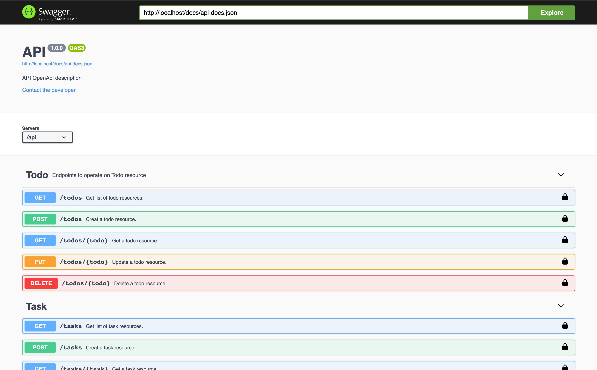

# RESTful Todo API with Laravel 8, OpenAPI specs and Swagger UI  

This project uses Docker desktop for local development.   
The APP is located in `src/` directory. In the root, docker related files are located.

## TDD

I developed this API with TDD software development process. So, there are feature tests for each endpoint. You can check
Laravel's [testing](https://laravel.com/docs/8.x/testing) documentation.

###### Artisan command to run PHP-Unit tests

`php artisan test`

## GET STARTED 

If you have `Makefile` on your host machine you can use make commands mentioned in this README, otherwise you need to 
use relevant original commands. You need to run make command from the root of the project.

To start Docker environment 

`make env-start`

### API

The API application provides an OpenAPI documentation. Once the Docker environment is up, visit 
[http://localhost](http://localhost). You can see request and response structures and run the endpoints.

#### API Setup

You can use following commands;

`make api-migrate`: Migrate the database   
`make api-seed`: Seed(populate) the database with fake data    
`make api-migrate-seed`: Combination of above 2 methods

###### Help

To see all options, run: 

`make`

#### Swagger UI SS

#### PHP-Unit test result

